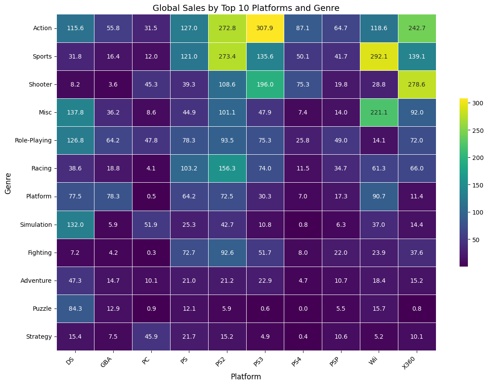
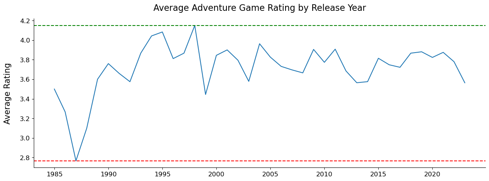

# Project of Data Visualization (COM-480)

| Student's name | SCIPER |
| -------------- | ------ |
| Haotian Wu | 351555 |
| Erchang Ni | 352440 |
| Jingbang Liu| 369414 |

[Milestone 1](#milestone-1) • [Milestone 2](#milestone-2) • [Milestone 3](#milestone-3)

## Milestone 1 (29th March, 5pm)

**10% of the final grade**

<!-- This is a preliminary milestone to let you set up goals for your final project and assess the feasibility of your ideas.
Please, fill the following sections about your project.

*(max. 2000 characters per section)* -->

### Dataset
- [Global Video Game Sales](https://www.kaggle.com/datasets/thedevastator/global-video-game-sales): A dataset contains information about the global sales of top video games across different platforms and genres. The original dataset contains a list of video games with sales greater than 100,000 copies from [vgchartz.com](https://www.vgchartz.com), which is scraped by [Gregory Smith's work](https://zenodo.org/records/5898311#.Y9Y2K9JBwUE).
- [Popular Video Games 1980 - 2023](https://www.kaggle.com/code/hossamelshabory97/popular-video-games-1980-2023-eda): This dataset contains a list of very pupular video games released from 1980 to 2023, it also provides other things such as release dates, user review rating, discribe summary and critic review rating, which are super useful for us to find out some interesting insights about the popularity of video games recently. 
- [Videogame-company-regions](https://www.kaggle.com/datasets/andreshg/videogamescompaniesregions): This dataset contains information on 686 video game publishers, covering nearly all major game publishers. It can be used in conjunction with other datasets for comprehensive analysis.
#### Ⅰ. Global Video Game Sales Dataset
> **Size**: 11 columns and 16600 rows

| Column Name   | Description                                                   |
|---------------|---------------------------------------------------------------|
| Rank          | Ranking of the game based on global sales. (Integer)          |
| Name          | Name of the game. (String)                                    |
| Platform      | Platform the game was released on. (String)                   |
| Year          | Year the game was released. (Integer)                         |
| Genre         | Genre of the game. (String)                                   |
| Publisher     | Publisher of the game. (String)                               |
| NA_Sales      | Sales of the game in North America. (Float)                   |
| EU_Sales      | Sales of the game in Europe. (Float)                          |
| JP_Sales      | Sales of the game in Japan. (Float)                           |
| Other_Sales   | Sales of the game in other regions. (Float)                   |
| Global_Sales  | Total sales of the game worldwide. (Float)                    |

#### Ⅱ. 1980-2023 Popular Video Games Dataset
> **Size**: 14 columns and 1512 rows

| Column Name   | Description                                                   |
|---------------|---------------------------------------------------------------|
| Title         | Title of the game. (String)                                   |
| Release Date  | Date of release of the game's first version. (Object)         |
| Team          | Game developer team. (String)                                 |
| Rating        | Average rating. (Float)                                       |
| Times Listed  | Number of users who listed this game. (Object)                |
| N of Reviews  | Number of reviews received from the users. (Object)           |
| Genres        | All genres pertaining to a specified game. (List)             |
| Summary       | Summary provided by the team. (String)                        |
| Reviews       | User reviews. (String)                                        |
| Plays         | Number of users that have played the game before. (Object)    |
| Playing       | Number of current users who are playing the game. (Object)    |
| Backlogs      | Number of users who have access but haven't started. (Object) |
| Wishlist      | Number of users who wish to play the game. (Object)           |

#### Ⅲ. Videogame-company-regions Dataset
> **Size**: 7 columns and 686 rows

| Column Name   　　　　　　　　　　　　　　| Description                                                   |
|--------------------------------------|---------------------------------------------------------------|
| Developer     　　　　　　　　　　　　　　| Company name. (String)                                        |
| City                    　　　　　　　　| City of company headquarters. (String)                        |
| Administrative division 　　　　　　　　| State(US) of the compy headquarts. (String)                    |
| Country           　　　 　　　　　　　　| Country of company headquarters. (String)                     |
| Est.  　　　　　　        　　　　　　　　| Founding date of the company. (Integer)                       |
| Notable games, series or franchises  | Some of the top games of the company. (Object)               |
| Notes        　　　　　　　　　　　　　　 | Interesting notes. (Object)                                  |

#### Ⅳ. Preprocess
For the *Global Video Game Sales* and *Videogame-company-regions* dataset, we merged the two dataset by the column **Publisher** and **Developer**, for the convenience of futher analysis. 

For the *Popular Video Games 1980 - 2023*, we first clean up the dataset by dropping the first meaningless column and some rows including **null** values. After that, we do a deeper cleaning by removing the rows where its **Release Date** is "releases on TBD", changing the columns name to lower case, replacing spaces with "_" for consistency and converting the special data type “K“ into the integer (1000) for some columns. 

For more details please check our jupyter notebook [eda.ipynb](https://github.com/com-480-data-visualization/project-2024-Moonwalker/blob/master/data/eda.ipynb).

### Problematic

<!-- 
> Frame the general topic of your visualization and the main axis that you want to develop.
> - What am I trying to show with my visualization?
> - Think of an overview for the project, your motivation, and the target audience. 
-->

Emerging from the virtual realms of fantasy and technology, video games have grown into much more than engaging digital experiences. They have ascended to cultural phenomena, modes of storytelling, platforms for social interaction, and arenas for intellectual challenge. Across the globe, gaming communities have become vibrant gathering spots for players, developers, and enthusiasts, fostering a rich culture of collaboration and competition. Furthermore, the video game industry is a significant economic powerhouse, offering vast opportunities for creativity, innovation, and employment in various sectors, from game design to marketing.

Recognizing the dynamic world of video games, our project offers an exhaustive exploration of the global gaming landscape. Our website provides a detailed account of video games' evolution, market trends, and the popularity of different genres. We aim to empower users with comprehensive knowledge about video games, enabling them to effortlessly discover games that resonate with their interests. Our website caters to both seasoned gamers and newcomers, ensuring everyone can find a game that suits their taste. Ultimately, we plan to offer personalized recommendations based on multiple game attributes, enhancing the gaming journey for our visitors.

Specifically, our website will roughly (might change sligthly overtime) contain the following visualizations

- Examines changes over time in the gaming industry, tracking shifts in consumer preferences.
- Identifies the platforms that are leading in worldwide game sales and explores the success of various game genres across different regions.
- Explore the game genres, game content and user behaviour for those high-rating video games worldwide.
- Provide users with information about video games that may be of interest to them based on game content and user preferences.

### Exploratory Data Analysis

<!-- 
> Pre-processing of the data set you chose
> - Show some basic statistics and get insights about the data 
-->
**Historical Trend in the Gaming Industry Over Time.**
There is a general upward trend in the number of games released annually from the early 1980s until the late 2000s. The peak of game releases occurs around the year 2008-2009. After the peak, there is a sharp decline in the number of games released. 

**Number of Games Released on Different Gaming Platforms.**
The platform with the highest number of game releases is the DS, which is Nintendo's handheld console, and the PlayStation 2 (PS2) follows closely behind.

**The Top Selling Game or Each Year.**
This chart representing the top-selling video game of each year, differentiated by total global sales. The picture indicates fluctuation in the total sales of top games year by year. In the late 2000s, there is a standout bar that significantly exceeds the others, which represents an exceptionally successful game in terms of sales.

**Video Game Sales by Publishers Across Different Regions.**
The charts show the top 10 publishers in each region, with Nintendo leading in global sales, followed by Electronic Arts and Activision. The charts provide a clear visual representation of the disparity in video game sales by publishers across different regions.

**Global Video Game Sales by Platform and Genre.**
This heatmap displays global sales of video games, categorized by the top 10 gaming platforms and game genres. The most sales in a single genre-platform combination are seen in the Action genre on a platform represented as "PS3," followed closely by Sports on "Wii.". The Sports and Action genres have high sales across several platforms, which suggests these genres are widely popular among different gaming audiences. Genres like Strategy, Puzzle, and Simulation have higher sales on older platforms.

**Video Game Genre Sales by Region.**
This heatmap visualizes the sales of different video game genres across various regions. Action and Sports genres dominate sales in NA and EU, while Role-Playing games have significant sales in JP. The Shooter genre is popular in NA and EU but has less impact in JP and Other regions.

**Number of Companies by Country.**
The picture shows the distribution of companies by country. The United States has the highest number of companies, followed by Japan and the United Kingdom. The United Kingdom comes in third, though with significantly fewer companies. Other countries listed have a much smaller number of companies.

**Top 10 Most Popular Video Games Genres.** 
This figure deisplays the top 10 popular video game genres, with 'Adventure' games leading the pack at 1005 games. Following are 'RPG' games with a significant count of 422 games. The genres 'Platform' and 'Shooter' are fairly close in popularity, with 282 and 270 games respectively. 'Brawler', 'Simulator', and 'Turn Based Strategy' genres have the fewest games among the top 10, with counts of 119, 109, and 99 games accordingly. The chart provides a clear visual representation of the disparity in popularity among different video game genres.

**Trends of the Average Adventure Video Games'Rating.**
This figure shows the average ratings for adventure games from 1985 to around 2020. There’s a notable peak in the early '90s, followed by a sharp decline. Ratings fluctuate afterwards but stay mostly above 3.5. The trend from 2010 onwards is slightly downward, suggesting a recent dip in ratings for the genre. Overall, the genre’s ratings have varied but stayed within a defined range over the years.

### Related work

#### 1. What others have already done with the data?
Several analyses and visualizations have been conducted using our dataset, including:

- [Visualizing Video Game Data 2007 – 2016 with Tableau](https://studentwork.prattsi.org/infovis/visualization/visualizing-video-game-data-2007-2016-with-tableau/): This project explores the data trends in electronic game sales and investigates potential factors that may influence game sales, primarily using Tableau for analysis.
- [Data Analysis & Visualization: Video Game Sales](https://www.kaggle.com/code/yyxian/data-analysis-visualization-video-game-sales): This work analyzed the Global Video Game Sales dataset using R.
- [Popular Video Games 1980 - 2023](https://www.kaggle.com/code/hossamelshabory97/popular-video-games-1980-2023-eda): This work analyzed the Popular Video Games 1980 - 2023 dataset using python.

#### 2. Why is your approach original?
Most of the analyses we encountered did a good job of describing various features of the dataset itself, but often only provided static visualizations, making them somewhat rigid. We believe video games should be a lively and engaging topic, so when implementing visualizations, we decided to use interactive visualization solutions that users can interact with to provide a novel experience, much like they would enjoy playing video games. Additionally, we decided to delve into some deeper research using existing datasets, rather than just describing the data itself. For example, we might utilize NLP-related techniques to develop a game recommendation feature.

In summary, we aim for our website to offer readers a pleasant and exciting experience, allowing them to appreciate the art of data as they engage in "playing" with it.

#### 3. What source of inspiration do you take? 

- [STEAM: Visualizing data from the gaming platform](https://steam.shardulaggarwal.com/genre): This is an interactive dashboard focusing on game data from the Steam platform. It offers various forms of data visualization with simple interactive features, allowing analysis from multiple perspectives such as game genres, developers, and players. It provides insights into our research questions and offers ideas for potential charts.

- [Report on Video Game Sales](https://public.tableau.com/app/profile/abhijit.bose/viz/VideoGameSales1980-2016_16768906660000/Dashboard1): This dashboard provides various chart analyses of trends in video game sales, offering some references for analyzing sales-related issues.

- [Matan Stauber Histography](http://histography.io): Although this project is unrelated to video games, its smooth interactive design around the timeline and presentation of relevant historical events greatly intrigues us. It may provide us with some inspiration for interactive design.

<!--- [Anime Data Visualization](https://github.com/com-480-data-visualization/com-480-project-worldwideweebz) : This project inspired us to come up with our figure 1, aiming to visualize the genre preference and popularity about the most authoritative game sales in the video game industry. -->

<!-- - In case you are using a dataset that you have already explored in another context (ML or ADA course, semester project...), you are required to share the report of that work to outline the differences with the submission for this class. -->

## Milestone 2 (26th April, 5pm)

**10% of the final grade**

## Milestone 3 (31st May, 5pm)

**80% of the final grade**

## Late policy

- < 24h: 80% of the grade for the milestone
- < 48h: 70% of the grade for the milestone

