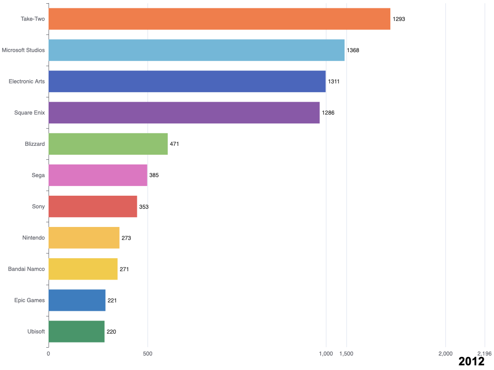

# Milestone 2 (26th April, 5pm)

## Tools
We will use **D3.js** from lecture *Interactive D3.js* to create dynamic, interactive data visualizations on the web.

## Sketches
In this section, we will display simple sketches of our visualizations, their purpose and the interactions we hope to achieve.

### Figure 1
Over the years, the platforms for playing video games have undergone significant changes, paralleling the broader evolution of the games themselves.

We'll start by showing the evolution of gaming platforms over time. The visualization will show the number of games released on each platform over the years. The user can hover over the graph to see the exact number of games released on a particular platform in a particular year. At the same time, a representative picture of the platform will be displayed in the blank space of the page.

### Figure 2
Then we will explore the popularity among game genres.

We will use a bubble chart to showcase the number of games for different genres. Each bubble will represent the number of games within a specific genre. Alongside, a timeline will depict the years. The bubble chart will dynamically change over time to reflect the shifts in game releases across different years, enhanced by engaging animation effects.

### Figure 3
<!-- 然后放platform上最受欢迎的游戏类型 -->
Next, we will study the game tonality of each platform.

We will show the most popular game genres on each platform using a chord diagram. In this diagram, each arc on the perimeter represents either a genre or a gaming platform, and the width of the arc represents the number of games of that genre or on that platform, indicating the number of games or popularity of each genre within each platform.

When a user clicks on a chord connecting a genre to a platform, an information card will appear. This information card would present the most popular game within the selected genre for the chosen platform.

### Figure 4
To delve deeper into the world of video games, we can't overlook their creators. 

We intend to use a bar race visualization to depict the sales performance of the top 10-15 game publishers from 2000 to 2016. This will highlight the rise and fall of game sales for different publishers, revealing industry stalwarts and emerging dark horses who seized opportunities and rose to prominence.

### Figure 5
<!-- 选择一个喜欢的游戏 -->
Finally, we will show a cute and pastel-themed interface to let you select your favorite game.

Our video game portal introduces an enchanting filtering experience that revolves around four essential attributes: Price, Rating, Genres, and Release Date. These attributes were selected for their distinctiveness and relevance in helping gamers find their ideal video game.

Welcome to the first look at our interface! As you navigate, you'll notice each circle symbolizes a unique video game, and they will dynamically walk randomly on the final website as well as interacting with your mouse. Adjacent to these, clickable buttons for each attribute allow you to tailor the display. 

Curious about the games you've filtered? The left side of the screen is your gateway to more information. Here, detailed descriptions and specifics of each game you're interested in are meticulously presented, enriching your exploration and selection process.

## Project BreakDown

## Extra Ideas
After the **Figure 5**, we plan to add one page of video games recommendation. We would like to use the dynamic 3D interactive network diagram to enhance game discovery experience. In this visual model, each node represents a unique video game, while the connecting lines, or edges, link games that share similarities. This setup allows you to navigate effortlessly from familiar games to new titles based on their related attributes.

This innovative approach targets casual gamers who may struggle to identify new games solely through game ownership. Instead, by interacting with games they already enjoy, users can naturally explore and uncover similar, new games. This method ensures a more intuitive and reliable way for users to expand their gaming horizons.

## Demo
You can visit the draft version of our website here [World of Video Games](https://major-blitz.github.io/com480-moonwalker/#firstPage).