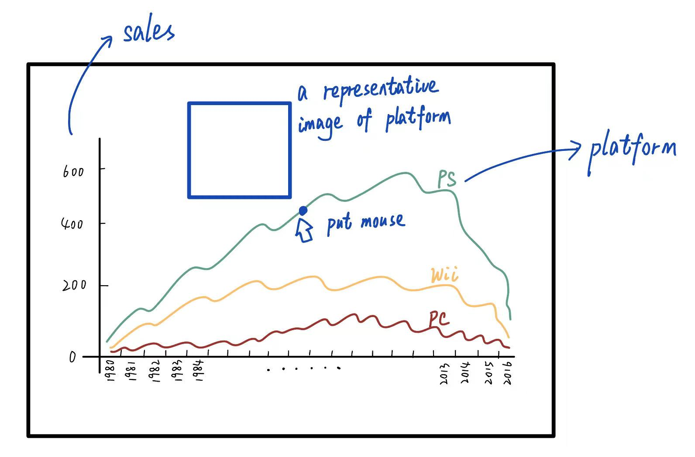

# Milestone 2 (26th April, 5pm)

## Tools
We will use **D3.js** from lecture *Interactive D3.js* to create dynamic, interactive data visualizations on the web.

## Sketches
In this section, we will display simple sketches of our visualizations, their purpose and the interactions we hope to achieve.

### Figure 1
Over the years, the platforms for playing video games have undergone significant changes, paralleling the broader evolution of the games themselves.

We'll start by showing the evolution of gaming platforms over time. The visualization will show the number of games released on each platform over the years. The user can hover over the graph to see the exact number of games released on a particular platform in a particular year. At the same time, a representative picture of the platform will be displayed in the blank space of the page.

### Figure 2

### Figure 3
<!-- 然后放platform上最受欢迎的游戏类型 -->
Next, we will study the game tonality of each platform.

We will show the most popular game genres on each platform using a chord diagram. In this diagram, each arc on the perimeter represents either a genre or a gaming platform, and the width of the arc represents the number of games of that genre or on that platform, indicating the number of games or popularity of each genre within each platform.

When a user clicks on a chord connecting a genre to a platform, an information card will appear. This information card would present the most popular game within the selected genre for the chosen platform.

### Figure 4
<!-- 各genre游戏的受欢迎程度随年份变化 -->

### Figure 5
<!-- 选择一个喜欢的游戏 -->

### Figure 6

## Project BreakDown

## Extra Ideas